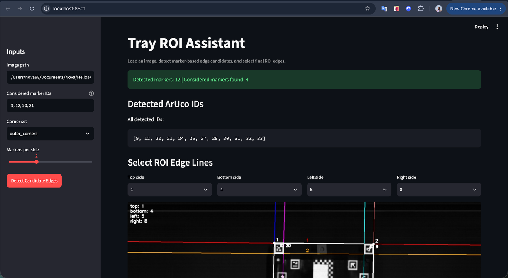
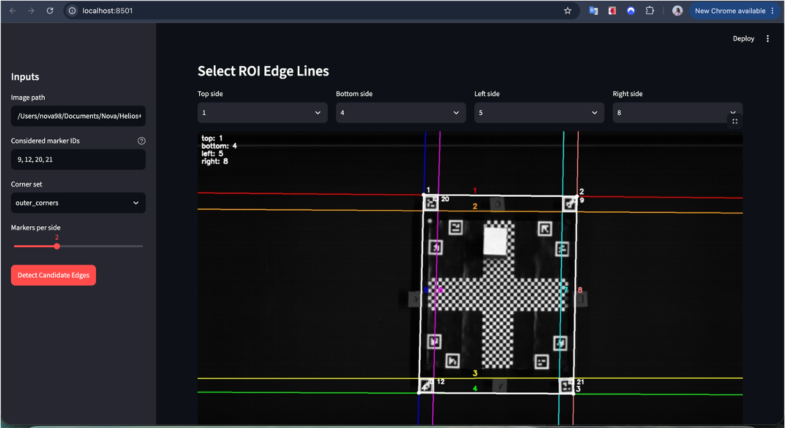

# ROI Detection
Region of Interest (ROI) detection on the conveyer belt using aruco markers. This app can take .png file or .hdr (ENVI format) file as input and crop the ROI from theinput image.

# Usage
Coming soon ...

# Acknowledgement
This work is performed at [Helmholtz Institute Freiberg for Resource Technology](https://www.hzdr.de/db/Cms?pOid=32948&pNid=2423&pLang=en) at the [Exploration](https://www.iexplo.space/) department

