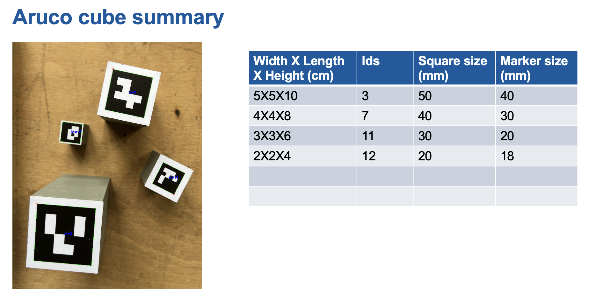
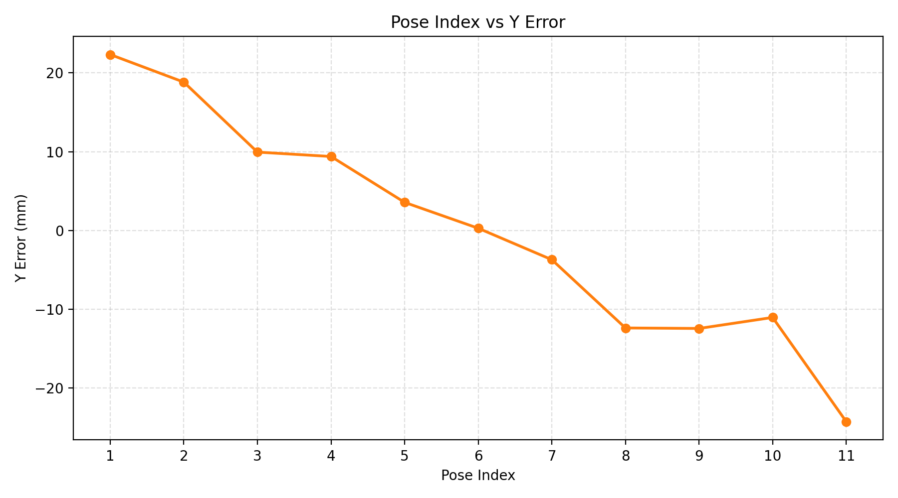

## 3d Cube summary


## Tray layout


## Workflow
- Place the cube in the above mentioned 12 positions
- Save the scans with name '_poseX_' where X is the pose number
- Store all the poses in a folder

  ```
  dataset_path/
    pose1/
        capture/
            .hdr
    pose2/
    ...
  ```
- Edit all the parameters in main.py
- Run main.py
- This will generate result in the dataset_path with metadata
